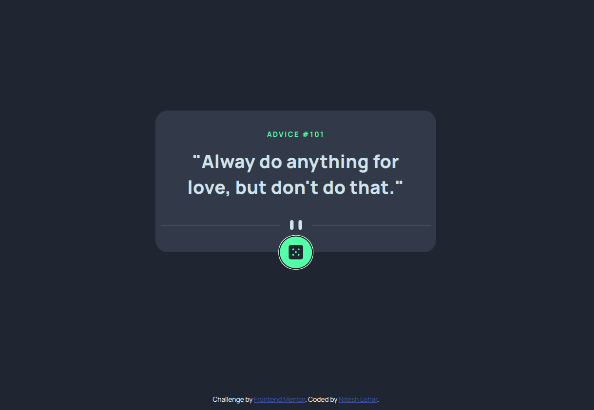

# Frontend Mentor - Advice generator app solution

This is a solution to the [Advice generator app challenge on Frontend Mentor](https://www.frontendmentor.io/challenges/advice-generator-app-QdUG-13db).  
Frontend Mentor challenges help you improve your coding skills by building realistic projects.

## Table of contents

- [Overview](#overview)
  - [The challenge](#the-challenge)
  - [Screenshot](#screenshot)
  - [Links](#links)
- [My process](#my-process)
  - [Built with](#built-with)
  - [What I learned](#what-i-learned)
  - [Continued development](#continued-development)
  - [Useful resources](#useful-resources)
- [Author](#author)

---

## Overview

### The challenge

Users should be able to:

- View the optimal layout for the app depending on their device's screen size
- See hover states for all interactive elements on the page
- Generate a new piece of advice by clicking the dice icon (data fetched from [Advice Slip API](https://api.adviceslip.com))

### Screenshot



### Links

- Solution URL: [URL](https://www.frontendmentor.io/solutions/)
- Live Site URL: [URL](https://nitesh-lohar.github.io/Advice-Generator/)

---

## My process

### Built with

- Semantic **HTML5** markup
- **CSS3** (Flexbox & Media Queries for responsiveness)
- **JavaScript (ES6+)**
- [Axios](https://axios-http.com/) for API calls


### What I learned

This project helped me practice:

- **DOM manipulation** using `querySelector` and `textContent`
- Handling **async/await** with `try...catch`
- Using **Axios** to fetch data from APIs
- Responsive design with **flexbox** and media queries

Example snippet I’m proud of:

```js
btn.addEventListener("click", async () => {
  let adviceObj = await genAdvice();
  adviceId.textContent = "Advice #" + adviceObj.slip.id;
  advice.textContent = `"${adviceObj.slip.advice}"`;
});
